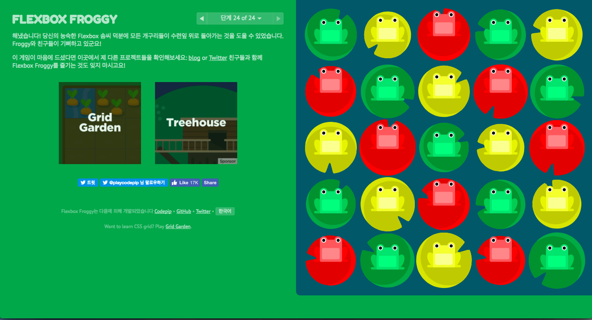

## flexboxfroggy cheat sheet

if you want clear yourself, turnback.

            

### stage01
>justify-content: flex-end;

### stage02
>justify-content: center;

### stage03
>justify-content: space-around;

### stage04
>justify-content: space-between;

### stage05
>align-items: flex-end;

### stage06
>justify-content: center; 
align-items: center;

### stage07
>justify-content: space-around; 
align-items: flex-end;

### stage08
>flex-direction: row-reverse;

### stage09
>flex-direction: column;

### stage10
>flex-direction: row-reverse; 
justify-content: flex-end;

### stage11
>flex-direction: column; 
justify-content: flex-end;

### stage12
>flex-direction: column-reverse; 
justify-content: space-between;

### stage13
>flex-direction: row-reverse; 
justify-content: center; 
align-items: flex-end;

### stage14
>order: 1;

### stage15
>order: -1;

### stage16
>align-self: flex-end;

### stage17
>order:1; 
align-self: flex-end;

### stage18
>flex-wrap: wrap;

### stage19
>flex-direction: column; 
flex-wrap: wrap;

### stage20
>flex-flow: column wrap;

### stage21
>align-content: flex-start;

### stage22
>align-content: flex-start;

### stage23
>align-content: flex-end;

### stage24
> flex-flow: column-reverse wrap;  
align-content: center;

