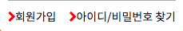
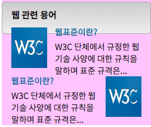
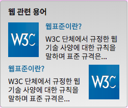

# 20180125 (랭크챠트, 푸터) 

## 새로 배운 태그 
## 새로 배운 속성
## 랭크챠트 
## 푸터 
## 그리드시스템 

### 새로 배운 태그
   1. q : inline속성의 참조를 나타내는 태그
   2. blockqutoe : block속성의 참조를 나타내는 태그
   3. address : 주소를 나타내는 태그

### 새로 배운 속성 
   1. cite : q태그에서 사용, 참조하는 웹의 정보를 나타냄 
   2. counter-increment : 증감하는 변수를 선언 
   3. counter: 선언한 변수를 사용하여 숫자를 나타냄 
   4. white-space: element안의 white-space 사용방법 결정  


### 랭크챠트 
   1. list-style을 사용하지 않기 위해
      - overflow: hidden
      - coutner-increment: number;
      - content: count(number, decimal) 
   2. IR&스프라이트 이미지가 width, height 보다 작은 경우 
      -  비율로써 이미지의 위치를 찾아감. 
```css
    .up { background-position: 0 0;}
    .stop {background-position: 0 50%;}
    .down {background-position: 0 100%;}
```

### 푸터 
   1. 이미지를 다른영역에 겹치기 
```html
<article>
    <h2></h2>
    <p></p>
</article>
```
```css
article {
    position: relative;
}
h2::before {
    content: "";
    width: 100%;
    height: 100%;
    position: absolute;
    top: 0;
    left: 0;
    background: url('./images/coffee.png') no-repeat;
}
h2 {
    width: 110px;
    height: 83px;
    text-align: center;
    line-height: 83px;
    position: absolute;
    left: 25px;
    bottom: -35px;
}
```

   2. margin을 이용하여 영역 나누기 
      - "margin: 0 auto"를 이용하거나, 직접 px을 입력하여 나눔. 

### 그리드시스템. 
   3. 사용방법 (예시 2*2)
      - display: grid
      - grid-template-columns: 10px 10px
      - grid-template-rows: 10px 10px;
      - grid-template-areas: 
         "template   content"
         ".          content"


# 20180124 (IR&스프라이트, 애니메이션) 

## 새로 배운 태그 
## IR&스프라이트  
## 애니메이션  
## dropdown list 이슈사항 
## CSS 구체성 이슈사항 

### 새로 배운 태그  
   1. animation
   2. transition 
      - rotate 
      - scale  
      - skew 
      - translate
   3. transform 
   4. outline 
   5. text-indent 
   6. strong
   7. em
   8. i
   9. b
   10. clip-path (clip) 
   11. select (form-fieldset-legend 사전사용)  

### IR&스프라이트  
   1. ImageReplacement로써 시각이미지를 대체하는 글을 넣는 방법을 의미한다. 시각장애인을 위한 접근성을 높이는 것 뿐만이 아니라, 봇이 정보를 가져가는 데에도 도움이 되는 내용이다. 
   2. 방법1 : box상자 크기를 padding으로 넘기고 overflow를 적용
   3. 방법2 : 2개의 TAG를 사용하고 TEXT위에 이미지를 덮는다. 

### 애니메이션 
   1. animation: 진행과정별 적용 효과를 설정할 수 있다. 
   2. transition: 시작과 끝을 설정하고 delay 적용을 통한 시차별 효과를 적용할 수 있다. 
   3. transform: animation, transition의 실제 움직임을 적용하는 명령어

### [dropdown 이슈사항]()   
   1. select 태그를 사용할 것인가 아닌가? 
      - property를 변경하여 사용시 웹접근성이 떨어지는 이슈 발생  
        (onChange 프로퍼티를 사용하여 키보드로 접근만 했는데 명령이 실행되는 이슈 발생)
   2. select 태그를 사용하지 않는 경우 
      - 키보드를 사용하여 항목들을 접근하기 힘든 이슈 발생

### CSS 구체성 이슈사항  
```
<div class="specific">
    <div class="active"></div>
</div>
```
```css 
.specific div {
    background: pink;
}
.active {
    background: blue;
}
```
   1. (.specific div)와 div에 (.active)를 동적으로 추가하는 경우 
   2. active 클래스가 적용되지 않는다. CSS 구체성 점수가 낮기 때문에 cascading이 발동되지 않는다.
   3. 방지방법  
      - 대표속성이 아니라 개별속성을 적용한다. (예: background-color)
      - css selector를 클래스로 통일한다. 

# 20180123 (서치폼, 탭, 새소식) 
## 서치폼   
## 탭   
## 새소식   

### 탭 
   1. class를 사용하여 active, deactive 변화. 

### 서치폼
   1. form태그는 flex를 사용시 오류가 가장 많은 부분중 한개 이다.  

### 새소식    
   1. position만 사용하여 구조 잡기 (float, flex 사용하지 않기)


--- 


# 20180122 (aside 구조 잡기) 

## 로그인폼   
## pseudo-element 활용 (반복패턴, display속성 활용)
## display속성값에 따른 작용  
## float을 이용한 layout배치 
## HTML 논리적 구조 잡기 

### HTML 논리적 구조 잡기


기존의 코드 (디자인 중심적으로 생각을 하여 가로/세로를 나눔)
```html 
<div class="term">
    <h2>웹 관련 용어</h2>
    <div class="term-wrapper">
        <div>
            <div class="term-head">웹 표준 이란?</div>
            <div class="term-content">W3 단체에서 규정한 웹기술 사양에 대한 규칙을 말하며 표준 규격은 어리마넝라ㅣ먼ㅇ라ㅣㅓㅁㄴ아ㅣ러마니어림ㄴㅇ라ㅣㅓㅁ나ㅣ어ㅏㅣㅁ넝라ㅣㅓㅁㄴ아ㅣ러ㅣㅏㅇ너라ㅣㅓㅁ나일</div>
        </div>
        <div class="term-picture"></div>
    </div>
</div> 
```

새로 만든 코드
```html
<div class="term">
    <h2 class="term-heading">웹 관련 용어</h2>
    <dl class="term-list">
        <dt class="term-list-heading">웹표준이란?</dt>
        <dd class="term-list-thumbnail"></dd>
        <dd class="term-list-brief">W3C 단체에서 규정한 웹 기술 사양에 대한 규칙을 말하며 표준 규격은...</dd>
    </dl>
</div>
```

### pseudo-element 활용하기  
1. 글의 이미지 삽입하기  

기존코드
```html 
<div>
    <p>이미지</p>
    <div>글자</div>
</div>
```

새로만든 코드  
```html
<div>
    <div>글자</div>
</div>
```
```css
div::before {
    content: "";
    background: url(이미지);
}
```

2. float에서 높이값 세팅하기 


```html
<div class="term">
    <h2 class="term-heading">웹 관련 용어</h2>
    <dl class="term-list">
        <dt class="term-list-heading">웹표준이란?</dt>
        <dd class="term-list-thumbnail"></dd>
        <dd class="term-list-brief">W3C 단체에서 규정한 웹 기술 사양에 대한 규칙을 말하며 표준 규격은...</dd>
    </dl>
</div>
```


```css 
.term-list::after {
    content: "";
    display: block;
    clear: both;
}
```